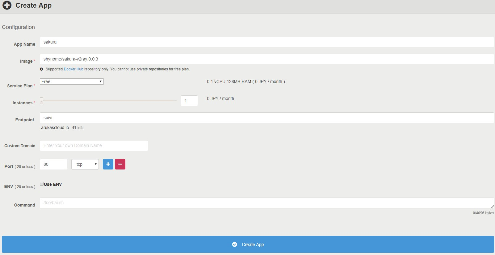

### 简介

通过 app.arukas.io 的首个容器永久免费的计划搭建备用代理

### 如何使用

- https://app.arukas.io 注册账号完成验证 （注：我创建应用的时候被要求验证信用卡和手机号码，不知道现在改了没，以遇到的为准）
- 创建容器， 配置如下：(其中镜像名是：`shynome/sakura-v2ray:0.0.3` )
  
- 判断是否创建成功，访问 `endpoint` 看下，如果是 `404` 则创建成功了， `503` 则是还在创建中
- 在 `v2rayN` 中导入分享链接后进行修改，只要修改服务器地址(即上图中的 Endpoint)就能用了
  分享链接：<pre>vmess://ew0KICAidiI6ICIyIiwNCiAgInBzIjogImFydWthcy5pbyB3cyIsDQogICJhZGQiOiAic3VpeWkuYXJ1a2FzY2xvdWQuaW8iLA0KICAicG9ydCI6ICI0NDMiLA0KICAiaWQiOiAiODk4MmJhYzAtZTFmYy00YzA5LWJlYTMtM2EwZTQwMmZhYmQzIiwNCiAgImFpZCI6ICI2NCIsDQogICJuZXQiOiAid3MiLA0KICAidHlwZSI6ICJub25lIiwNCiAgImhvc3QiOiAiIiwNCiAgInBhdGgiOiAiL3JheSIsDQogICJ0bHMiOiAidGxzIg0KfQ==</pre>

### 环境变量使用

如果你不明白下面的变量是干啥的，请不要修改

环境变量 | 默认值 | 用途
--|--|--
VMESS_ID | `8982bac0-e1fc-4c09-bea3-3a0e402fabd3` | vmess id
PROXY_PATH | `/ray` | ws proxy path
